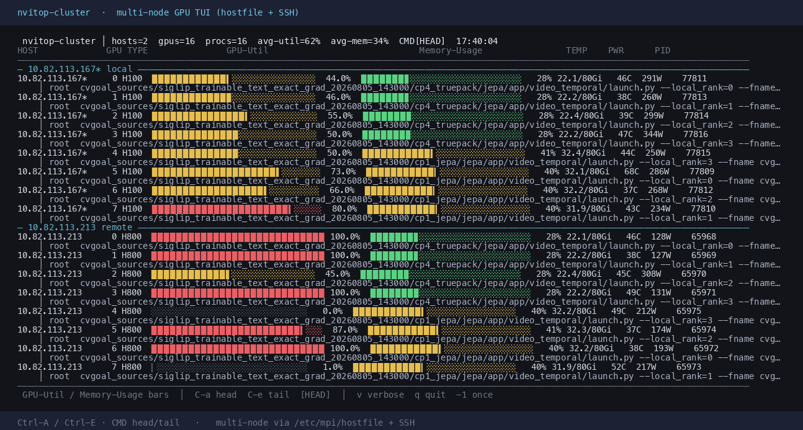

# nvitop-cluster

Multi-node GPU monitor for training clusters: read MPI/OpenMPI **hostfile**, query each host (local NVML / remote SSH), show **nvitop-style** UTIL/MEM bars, temperatures, power, and **resolved process command lines**.

Designed for multi-node jobs (e.g. DeepSpeed / torchrun / MPI) where plain `nvitop` only sees the current machine.

## Screenshot



*Sample from a 2-node × 8-GPU job (`/etc/mpi/hostfile`). Bars = GPU util (left) / memory (right). Second line per GPU is the process command (Ctrl-A / Ctrl-E switch head vs tail when truncated).*

## Features

- **Hostfile discovery**: `/etc/mpi/hostfile`, `/etc/mpi/mpi-hostfile`, or `-f PATH`
- **Local + remote**: local probe without SSH; peers via `ssh` (optional KML-style `ssh_config`)
- **Wide dual bars**: GPU-Util and Memory-Usage (width scales with terminal)
- **Process names**: optional host-PID → container-PID remap for Kubernetes/container jobs
- **Watch mode by default** (2s); keys:
  - **Ctrl-A** / `a` — CMD head (like nvitop)
  - **Ctrl-E** / `e` — CMD tail
  - **v** — verbose full cmdline
  - **q** — quit

## Install

```bash
git clone https://github.com/Micuks/nvitop-cluster.git
cd nvitop-cluster
# optional: symlink into PATH
ln -sf "$PWD/nvitop_cluster/nvitop_cluster.py" ~/.local/bin/nvitop-cluster
chmod +x nvitop_cluster/nvitop_cluster.py
```

Requires: Python 3.9+, `nvidia-smi` on each node, SSH to peers (for multi-node).

Optional (local interactive nvitop + container PID fix):

```bash
pip install nvitop
# then use the wrapper entry: nvitop_cluster/nvitop --cluster
```

## Usage

```bash
# multi-node table (default: watch 2s)
python3 nvitop_cluster/nvitop_cluster.py
# or
nvitop-cluster

# once
nvitop-cluster -1

# custom hostfile / SSH config
nvitop-cluster -f /path/to/hostfile
export NVITOP_CLUSTER_SSH_CONFIG=~/.ssh/config

# via nvitop-compatible wrapper
python3 nvitop_cluster/nvitop --cluster
python3 nvitop_cluster/nvitop --cluster -1 --cmd-align right
```

### Hostfile format

```text
10.0.0.1 slots=8
10.0.0.2 slots=8
```

(Also accepts bare hostnames / `host:slots`.)

### Environment

| Variable | Meaning |
|----------|---------|
| `NVITOP_CLUSTER_HOME` | Directory containing probe scripts (default: package dir) |
| `NVITOP_CLUSTER_SSH_CONFIG` | SSH config for peers (default: `/etc/kml/ssh/ssh_config` if present) |
| `NVITOP_HOSTFILE` | Extra hostfile path candidate |
| `NVITOP_CLUSTER=1` | Force cluster mode when using the `nvitop` wrapper |

## Container / Kubernetes note

On many GPU pods, NVML reports **host PIDs** while `/proc` only has **namespace PIDs**, so process names become `N/A`. `nvitop_pid_map.py` remaps host→local PIDs (heuristic: rank / device / RSS). Works on each node when `share` storage holds the same scripts (or install the package everywhere).

## Layout (vs plain nvitop)

| | nvitop | nvitop-cluster |
|--|--------|----------------|
| Scope | Current host | All hostfile hosts |
| UI | Full interactive TUI | Watch table + keys |
| Remote | — | SSH probe |
| Processes | Yes | Yes (resolved when possible) |

## License

Apache-2.0 (see [LICENSE](LICENSE)).

## Related

- [nvitop](https://github.com/XuehaiPan/nvitop) — single-node interactive viewer
- [all-smi](https://github.com/lablup/all-smi) — multi-host accelerator TUI
- [gpustat-web](https://github.com/wookayin/gpustat-web) — multi-node web dashboard
